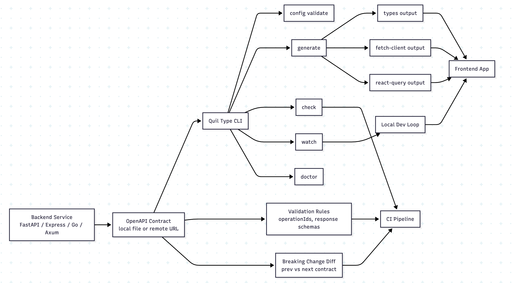

# Quill Type

[](https://github.com/kariebi/quilltype/actions/workflows/ci.yml)

Quill Type is an OpenAPI workflow CLI for teams that want more than raw type generation.

It validates contract quality, generates typed frontend outputs, checks for breaking API changes, supports config-first and flags-first usage, and keeps schemas in sync during development.



## Why Quill Type

Type generation is only part of the workflow. Teams also need:

- stable generation commands
- repeatable config
- breaking-change checks in CI
- multiple outputs from one contract
- watch mode for local development
- a path that works across different backend stacks

Quill Type focuses on that whole contract workflow instead of only the schema-to-type conversion step.

## When To Use Quill Type

Use Quill Type when:

- your backend exposes OpenAPI and you want generated frontend artifacts
- you need CI to catch stale generated files
- you want contract changes reviewed as API changes, not only code changes
- you want one tool to drive `types`, lightweight fetch clients, and React Query helpers
- you work across multiple backend ecosystems such as Python, Node, Go, or Rust

Use a lower-level generator directly when:

- you only want a single one-off `.d.ts` file
- you do not need validation, watch mode, or breaking checks
- your team already has a complete wrapper around OpenAPI generation

## Quill Type vs `openapi-typescript`

`openapi-typescript` is excellent at turning an OpenAPI contract into TypeScript types.

Quill Type builds on that layer and adds workflow features around it:

- multiple output modes
- config schema and validation
- flags-first shortcuts
- watch mode
- diagnostics
- breaking-change checks
- CI-friendly stale-output detection

If you only need types, `openapi-typescript` alone may be enough. If you want a contract workflow tool, Quill Type is the better fit.

## Quill Type vs `orval`

`orval` is a strong client generator with rich frontend integrations.

Quill Type is different in emphasis:

- smaller CLI surface
- simpler output model
- contract validation rules
- explicit breaking-change checks
- easier multi-stack examples and contract workflows

If your main goal is deep client-generation features across many frontend styles right now, `orval` may still be stronger. If your goal is contract discipline plus generation, Quill Type is designed for that lane.

## Quickstart

Install from npm:

```bash
npm install -g quilltype
quilltype --help
```

Initialize a config:

```bash
quilltype init
```

Generate code:

```bash
quilltype generate
```

Validate and check:

```bash
quilltype config validate
quilltype check
```

Watch:

```bash
quilltype watch
```

More setup detail:
[Quickstart guide](./docs/quickstart.md)

## Contributing From Source

Contributors and maintainers can run Quill Type directly from the repository:

```bash
npm install
npm run build
```

Initialize a config:

```bash
node dist/cli.js init
```

Generate code:

```bash
node dist/cli.js generate
```

Validate and check:

```bash
node dist/cli.js config validate
node dist/cli.js check
```

Watch:

```bash
node dist/cli.js watch
```

## Stable Commands

```bash
quilltype init
quilltype generate
quilltype check
quilltype watch
quilltype config validate
quilltype doctor
```

## Config-First And Flags-First

Config-first:

```bash
node dist/cli.js generate --config ./quilltype.config.json
```

Flags-first:

```bash
node dist/cli.js generate \
  --input ./examples/petstore.openapi.json \
  --output ./src/generated/api-types.ts:types \
  --output ./src/generated/api-client.ts:fetch-client \
  --output ./src/generated/api-react-query.ts:react-query
```

## Outputs Reference

Supported output modes:

- `types`
- `fetch-client`
- `react-query`
- `axios-client`
- `swr`
- `zod`
- `json-schema`

All generated files include:

- a source banner
- the output mode
- deterministic formatting for clean CI checks

More detail:
[Outputs reference](./docs/outputs-reference.md)

## Config Reference

Quill Type looks for:

- `quilltype.config.json`
- `quilltype.config.yaml`
- `quilltype.config.yml`

It also ships a schema file:
[schemas/quilltype.schema.json](./schemas/quilltype.schema.json)

Recommended default config:

```json
{
  "$schema": "./schemas/quilltype.schema.json",
  "source": {
    "path": "./examples/petstore.openapi.json"
  },
  "outputs": [
    {
      "path": "./src/generated/api-types.ts",
      "mode": "types"
    },
    {
      "path": "./src/generated/api-client.ts",
      "mode": "fetch-client"
    },
    {
      "path": "./src/generated/api-react-query.ts",
      "mode": "react-query"
    }
  ],
  "validation": {
    "requireOperationIds": true,
    "requireResponseSchemas": true
  },
  "watch": {
    "pollIntervalMs": 30000,
    "retryDelayMs": 5000
  }
}
```

More detail:
[Config reference](./docs/config-reference.md)

## Breaking-Change Checks

Quill Type can compare a next contract to a previous one during `check`.

Current checks include:

- removed paths
- removed operations
- removed response status codes
- removed enum values
- incompatible schema type changes
- request fields that became required
- request parameters that became required
- response fields removed from successful responses

Guide:
[Breaking-change checks](./docs/breaking-changes.md)

## CI Setup

Typical CI sequence:

```bash
npm ci
npm run build
npm test
node dist/cli.js generate --config ./quilltype.config.json
node dist/cli.js check --config ./quilltype.config.json
```

Guide:
[CI setup guide](./docs/ci-setup.md)

## Contributing

Contributor setup and release notes live in:
[Contributing guide](./CONTRIBUTING.md)

## More Docs

- [Migration from `openapi-typescript`](./docs/migrate-from-openapi-typescript.md)
- [Migration from `orval`](./docs/migrate-from-orval.md)
- [Cookbook recipes](./docs/cookbook.md)
- [Troubleshooting guide](./docs/troubleshooting.md)
- [Compatibility notes](./docs/compatibility.md)

## Examples

Quill Type includes small examples for multiple backend stacks:

- [FastAPI](./examples/fastapi/README.md)
- [Express](./examples/express/README.md)
- [NestJS](./examples/nest/README.md)
- [Go](./examples/go/README.md)
- [Rust + Axum](./examples/rust-axum/README.md)
- [Remote schema source](./examples/remote-schema/README.md)
- [Monorepo layout](./examples/monorepo/README.md)

Examples index:
[Examples overview](./examples/README.md)
